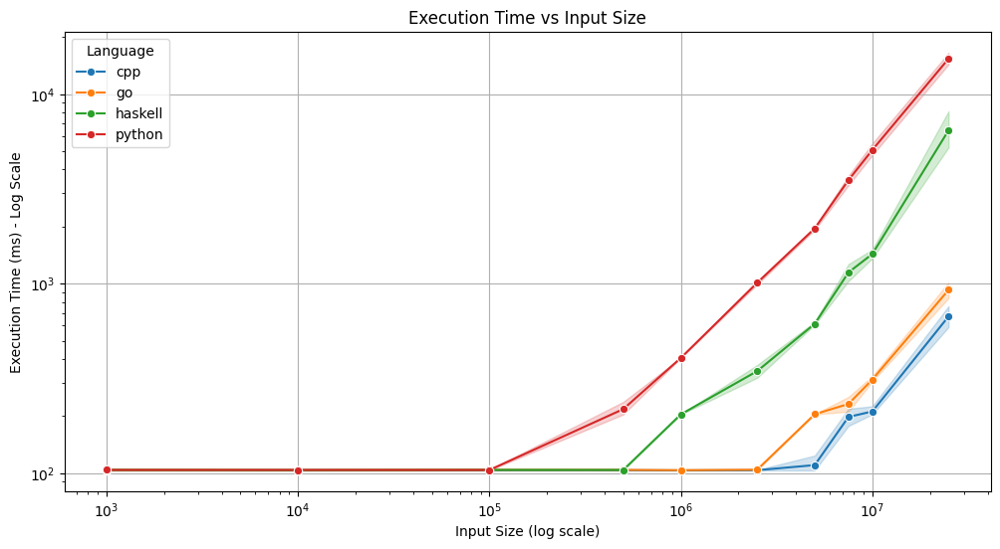

````markdown
# Multi-Language Parallel Maximum Search Benchmark Suite



## Technical Overview

This repository implements a parallel maximum search algorithm across multiple programming languages (C++, Go, Haskell, and Python), demonstrating various parallel programming paradigms and their performance characteristics in a controlled environment.

### System Configuration
- Platform: Linux (WSL2) x86_64
- Processor: 6 physical cores, 12 logical cores
- Memory: 7.61 GB
- Compiler/Runtime Versions:
  - GCC (C++17)
  - Go 1.11+
  - GHC 8.0+
  - Python 3.8.10

## Implementation Architecture

### 1. C++ Implementation (`max_thread.cpp`)
The C++ implementation leverages OpenMP, a powerful API for parallel programming, to efficiently compute the maximum value in a vector of integers. This implementation is designed to take advantage of multi-core processors, allowing for significant performance improvements over a single-threaded approach.

#### Key Features:
- **Parallelization with OpenMP**: The `parallel_max` function utilizes OpenMP's `#pragma omp parallel for` directive to distribute the workload across multiple threads. This allows the maximum value to be computed concurrently, significantly reducing execution time for large datasets.
  
- **Reduction Clause**: The use of the `reduction(max:total_max)` clause ensures that each thread computes a local maximum, which is then combined to produce the final result. This minimizes the overhead associated with thread synchronization.

- **Performance Testing**: The `main` function includes test cases that benchmark the performance of the parallel implementation against a standard sequential maximum search using `std::max_element`. This comparison provides insights into the speedup achieved through parallelization.

#### Example Code Snippet:
```cpp
int parallel_max(const std::vector<int>& numbers, int num_threads) {
    int total_max = std::numeric_limits<int>::min();

    #pragma omp parallel for num_threads(num_threads) reduction(max:total_max)
    for (size_t i = 0; i < numbers.size(); ++i) {
        total_max = std::max(total_max, numbers[i]);
    }

    return total_max;
}
```

- **Test Cases**: The implementation includes two test cases: one with random numbers and another with uniform values. This variety helps to evaluate the performance under different conditions.

- **Performance Metrics**: The results of the tests are printed to the console, showing both the regular and parallel maximum values, execution times, and the speed improvement factor.

### 2. Go Implementation (`max_thread.go`)
- Utilizes goroutines and channels for communication
- Efficient memory management through Go's runtime
- Performance: Second-best mean execution time

### 3. Haskell Implementation (`max_thread.hs`)
- Employs Software Transactional Memory (STM)
- Pure functional approach with MVars for synchronization
- Performance: Third place

### 4. Python Implementation (`max_thread.py`)
- GIL-constrained threading model
- Numpy-optimized operations where possible
- Performance: Baseline reference

## Performance Characteristics

### 1. Memory Efficiency
- C++: Lowest memory footprint
- Go: Efficient garbage collection
- Haskell: Higher memory overhead
- Python: Significant memory usage

### 2. Thread Scaling
- Linear scaling up to physical core count
- Diminishing returns beyond logical core count

### 3. Cache Effects
- Visible in performance jumps at cache boundaries

## Technical Insights

1. **Algorithmic Complexity**
   - Theoretical: O(n/p), where p = thread count
   - Practical: Limited by memory bandwidth

2. **Memory Access Patterns**
   - Sequential access benefits from hardware prefetching
   - Thread-local summation minimizes false sharing

3. **Synchronization Overhead**
   - Minimal in C++ (final reduction only)
   - Channel-based in Go (negligible impact)
   - STM overhead in Haskell (significant at scale)
   - GIL contention in Python (major bottleneck)

## Benchmark Runner Architecture

### Core Components (`run_benchmarks.py`)

1. **Execution Pipeline**
```python
def run_single_test(self, executable, size, num_threads, lang):
    process = psutil.Popen(
        cmd,
        stdout=subprocess.PIPE,
        stderr=subprocess.PIPE
    )
    metrics_samples.append(self._measure_process_metrics(process))
```
- Real-time metrics collection
- Process isolation per test
- Resource monitoring (CPU, memory, threads)

2. **Compilation Strategy**
- C++: `-O3 -pthread` optimizations
- Go: Native build with race detector
- Haskell: `-O2 -threaded` RTS options
- Python: JIT compilation through CPython